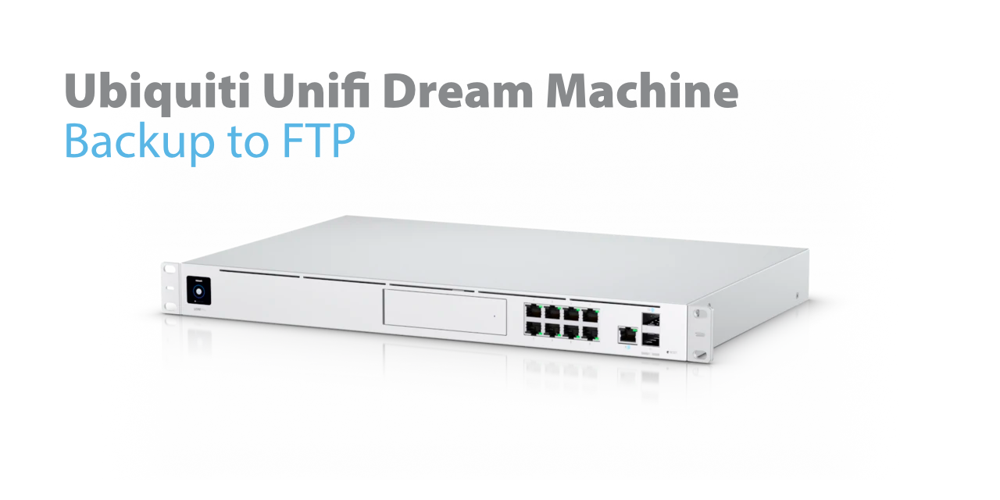

One problem of Ubiquitis Unifi Dream Machine (UDM / UDP Pro) is the automatic backup feature. Don't get me wrong... it is great to have an automatic backup feature, but storing backups just on the UDM itself is not a good practice. If you have to hard reset the UDM or the UDM dies, the backups get unaccessable and you have to start from scratch. Also, the newly introduced cloud backup feature is beta and doesn't take care about your Unifi Protection setup.

For security reasons, enabling SSH on the UDM and pull the backups from the UDM was not an option for me, as SSH on the UDM is reachable from every VLAN by using password authentication. You could configure that, but your configuration gets resettet on each boot.

So, pushing backups was the only option. For this I built this docker container, which starts, copies the backups to an external FTP server on your network or the internet and deletes itself.

> If you have a Unifi Cloud Key Gen 2, have a look at my FTP backup for Ubiquiti Unifi Cloud Key Gen 2. [aessing/uck-backup-ftp](https://github.com/aessing/uck-backup-ftp) 

## Steps to get up and running

1. Install UDM / UDM Pro [On-Boot-Script](https://github.com/boostchicken/udm-utilities/tree/master/on-boot-script) on your Dream Machine.

    The script of [boostchicken](https://github.com/boostchicken) aka John D. enables init.d style scripts which runs on your UDM at every boot. Normally the UDM resets on every boot and firmware upgrade, but the On-Boot-Script uses a feature of the UDM, which caches all debian style install packages and reinstalls them during the boot process. This enables us to persist and run scripts and customization during the boot process of the Dream Machine.
    - [GitHub Repo - UDM / UDMPro Boot Script](https://github.com/boostchicken/udm-utilities/tree/master/on-boot-script)    
    - [GitHub Repo - udm-utilities](https://github.com/boostchicken/udm-utilities)
    - [GitHub Profile - John D.](https://github.com/boostchicken)

1.  Customize conf.env with your own values and store in a folder called `/mnt/data/udm-backup-ftp` on your UDM (you can store the file wherever you want, but than you have to change the path in the `ENV_FILE` variable in the `80-udm-backup-ftp.sh` script file). In this example, which is also the default of the script file, the configuration is stored in `/mnt/data/udm-backup-ftp/conf.env`. 
    This file needs 4 variables to work, which are used by the container to logon to the FTP server and copy over the backups. 

    ```shell
    FTP_SERVER={SERVERNAME}
    FTP_PATH={BACKUPPATH}
    FTP_USER={FTPUSER}
    FTP_PASSWORD={FTPPASSWORD}
    ```
    Please make your the configuration file is only readable by root.
    ```shell
    chmod 0400 /mnt/data/udm-backup-ftp/conf.env
    ```

1.  Customize the [on_boot.d/80-udm-backup-ftp.sh](on_boot.d/80-udm-backup-ftp.sh) script and copy it over to the UDM into the On-Boot-Script folder (`/mnt/data/on_boot.d`).

    This script creates a cronjob, which pulls and starts the container to copy the automated backups to your FTP server. By default the container runs once per hour, which of course can be customized in the script.

    In the script you can configure two variables:
      - `ENV_FILE` if you are storing your FTP credentials in a different path than proposed (`/mnt/data/udm-backup-ftp/conf.env`).
      - Comment `PROTECT_MOUNT` variable if you do not want to do backups for Unifi Protect.

    Please make your changes and copy the script to `/mnt/data/on_boot.d`. You also have to make the script executeable.
    ```shell
    chmod a+x /mnt/data/on_boot.d/80-udm-backup-ftp.sh
    ```

1.  I recommend to pull the container image manually from [Docker Hub](https://hub.docker.com/repository/docker/aessing/udm-backup-ftp) before the cronjob runs the first time. Depending on your internet connection, this could take a moment.
    ```shell
    podman pull docker.io/aessing/udm-backup-ftp
    ```

1. To activate the cronjob you could reboot your UDM, or you could just run the script manually (my recommendation).
    ```shell
    /mnt/data/on_boot.d/80-udm-backup-ftp.sh
    ```

1. Check in the logs of the CRON daemon, if the backup script ran successfully. 
   ```shell
   tail -n 50 /var/log/cronjobs.log
   ```

## Upgrade
If a new version of the container is released, the update is done in 3 simple steps.

1. Check that the backup process and the container is actually not running
    ```shell
    podman ps
    ```

1. Delete the old container image
    ```shell
    podman rmi docker.io/aessing/udm-backup-ftp
    ```

1. Download the new docker container image from [Docker Hub](https://hub.docker.com/repository/docker/aessing/udm-backup-ftp)
    ```shell
    podman pull docker.io/aessing/udm-backup-ftp
    ```

---

## :ambulance: Support Information

For further information about this project, how to [contribute](CONTRIBUTING.md), or how to contact us, please have a look at the [support document](SUPPORT.md) of this repository. It also contains information about [security related topics](SECURITY.md), [licensing](LICENSE.md), and more.  

## :man_judge: Disclaimer

THE CONTENT OF THIS REPOSITORY IS PROVIDED "AS IS", WITHOUT WARRANTY OF ANY KIND, EXPRESS OR IMPLIED, INCLUDING BUT NOT LIMITED TO THE WARRANTIES OF MERCHANTABILITY, FITNESS FOR A PARTICULAR PURPOSE AND NONINFRINGEMENT. IN NO EVENT SHALL THE AUTHORS BE LIABLE FOR ANY CLAIM, DAMAGES OR OTHER LIABILITY, WHETHER IN AN ACTION OF CONTRACT, TORT OR OTHERWISE, ARISING FROM, OUT OF OR IN CONNECTION WITH THE CONTENT OF THIS REPOSITORY OR THE USE OR OTHER DEALINGS BY CONTENT OF THIS REPOSITORY.
